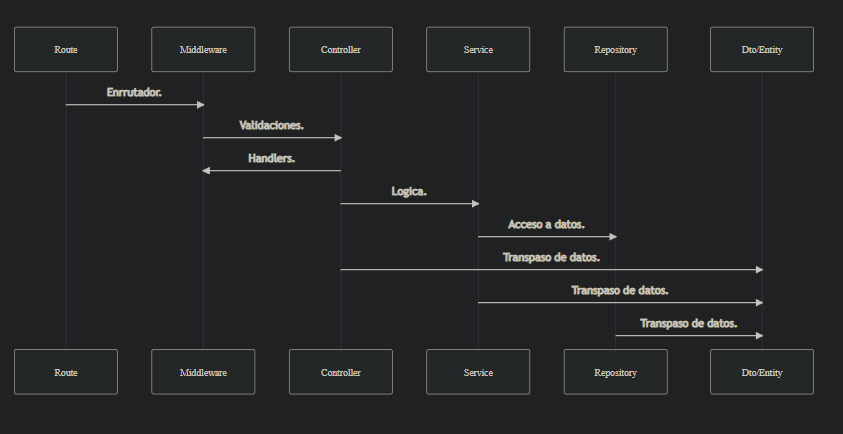

# Examen técnico de Meli Front-end

La solución esta compuesta por 2 aplicaciones, una frontend la cual esta basada en react y una en backend la cual esta basada en Express.

# Correr proyecto por primera vez.

Paso 0
---
Precondiciones: 
Se necesita tener instalado 
- `Node: 20.*`
- `Git`


Paso 1
---
Clonar el proyecto:
Entra a una terminar y baja el proyecto.
```bash
git clone https://github.com/juanNH/Meli_test.git
```

Paso 2
---
Correr el back-end.
Desde el root de donde se clono el proyecto, en la terminal escribe:
```bash
cd back-app
touch .env
echo "PORT=3010" > .env
npm i
npm run dev
```
Paso 3
---
Correr el front-end.
Desde el root de donde se clono el proyecto, en la terminal escribe:
```bash
cd front-app
touch .env
echo "API_URL=http://localhost:3010/api" > .env
npm i
npm run start
```

# Front-end

La aplicación de react con javascript y sass, con test en jest y cypress.
Scripts disponibles.
```json
"dev": "vite",
"build": "vite build",
"lint": "eslint . --ext js,jsx --report-unused-disable-directives --max-warnings 0",
"preview": "vite preview",
"test": "jest",
"test:coverage": "jest --coverage",
"test:match": "jest --testPathPattern=%npm_config_test%.test.js",
"test:match:coverage": "jest --testPathPattern=%npm_config_test%.test.js --coverage",
"cypress:start":"npx cypress open"
```
## Estructura de carpetas

En la carpeta de cypress se encuentran los test de casos de uso(e2e).
En src esta la app.
### assets
- Archivos de imágenes en la app.
--- 
### components
- #### Commons 
-	- Componentes que se utilizan comúnmente en la aplicación.
- #### layout
-	- Se encuentran los componentes de layout de la app, como appbar, lazyload.
--- 
### helpers
- Se tienen funcionalidades que se repiten en distintas partes y ayudan a abstraer logica.
---
### hooks
- Logica abstraida para facilitar su uso en la app.
---
### pages
- Pantallas de la app.
-	### Page*.jsx 
-	- Pantalla a la cual se accede.
-	### [vista]
-	- Las pantallas se van indexando en las carpetas según como se indexe.
-	### components
-	- Componentes que pertenecen a la vista.
---
### services
- Interacciones externas a la app.
-  #### Interceptors
- - Interceptors de peticiones fetch.

# Back-end

Aplicacion backend con Javascript y Express.
Scripts disponibles.
```json
"start": "node index.js",
"dev": "nodemon index.js",
"test": "jest",
"test:coverage": "jest --coverage",
"test:match": "jest --testPathPattern=%npm_config_test%.test.js",
"test:match:coverage": "jest --testPathPattern=%npm_config_test%.test.js --coverage"
```

## Estructura de carpetas

Dentro de src se encuentra la app.

### commons
- Logica reutilizable en multiples lugares como dtos, helpers, entidades, etc.

### middleware
- middlewares de la aplicacion. 

### v1
- Version 1 de la app.
- #### [Funcionalidades]
- - Carpetas con la funcionalidad de la app.
- #### middlewares
- - middlewares de las funcionalidades.
- #### tests
- - tests e2e 
- #### indexRouter
- - Router con las funcionalidades.


## Endpoints

Para mayor detalle de que es cada campo, respuesta y servicio debera ingresar a la app de swagger (Ingrese al primer endpoint de la tabla).

|Endpoints       |Recibe                     | Responde - Utilidad
|----------------|-------------------------------|-----------------------------|
|/api-docs/v1|           |`App de swagger para ver los endpoints y su implementacion`            |
|/api/v1/ping|            |`Pong, verifica que la app este levantada  `        |
|/api/v1/author|objeto author para facilitar su uso en otro lado|`objeto author a pegar en header donde se necesite `|
|/api/v1/items|un parametro "q" que se usa para buscar productos|`Author que consulta, items y categorias`|
|/api/v1/items/:id|id de item a buscar|`item y su detalle`|


## Arquitectura

Arquitectura dentro de cada funcionalidad.

